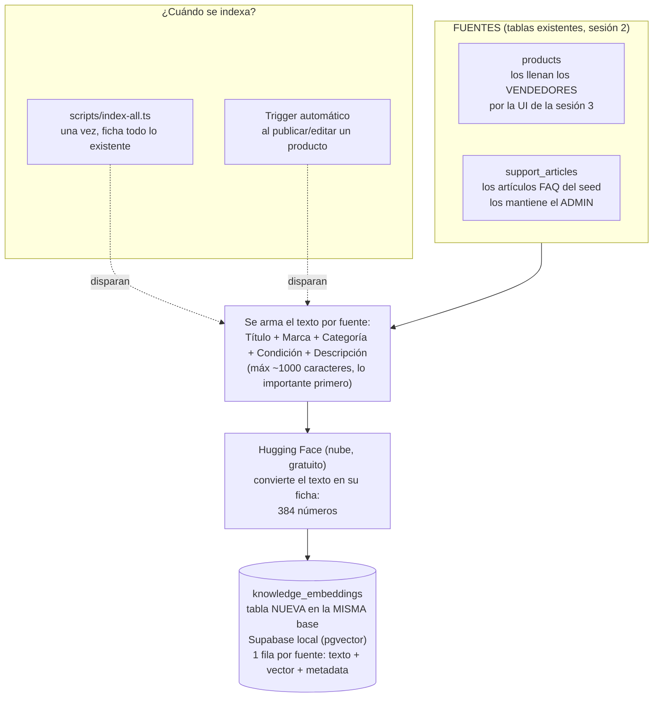
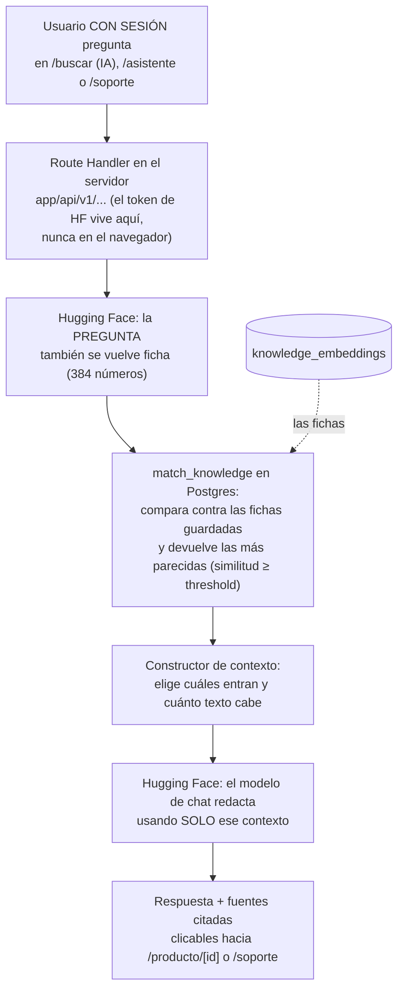

# RAG en MercadoTech — cómo funciona, casos probados y calibración

Este documento es para cualquiera que no haya programado esta parte: explica
qué pasa cuando alguien busca o pregunta algo, con los pasos exactos para
repetir cada prueba y ver lo mismo que vimos nosotros.

---

## Cómo funciona el flujo

MercadoTech ahora sabe buscar **por significado**, no solo por palabras
exactas. La analogía que gobierna todo: un **bibliotecario**.

1. **Fichar los libros (indexar).** Cada producto y cada artículo de la FAQ
   se convierte en una "ficha" numérica que resume su significado (un
   *embedding*, 384 números). Las fichas se guardan en una tabla nueva de la
   misma base de datos (`knowledge_embeddings`, con la extensión `pgvector`).
   Esto pasa una vez al inicio (con un script) y luego automáticamente cada
   vez que un vendedor publica o edita un producto.
2. **Buscar por las fichas (recuperar).** Cuando alguien pregunta, la
   pregunta también se convierte en ficha, y la base de datos encuentra las
   fichas más *parecidas* — no las que comparten palabras, sino las que
   hablan de lo mismo.
3. **Responder solo con las fichas encontradas (generar).** Un modelo de
   lenguaje redacta la respuesta usando ÚNICAMENTE esas fichas, citándolas.
   Si ninguna ficha sirve, lo dice: "no encontré productos que coincidan" —
   nunca inventa. Eso es RAG: *Retrieval-Augmented Generation* — recuperar
   primero, generar después.

### Pipeline 1 — Alimentación (indexar): ¿de dónde sale la info y dónde se guarda?



### Pipeline 2 — Consulta (responder): ¿qué pasa cuando alguien pregunta?



**Por qué importa:** no hay una "base de datos de IA" aparte — las fichas
viven en la misma Postgres de siempre y son derivadas (se pueden reconstruir
enteras corriendo `npx tsx scripts/index-all.ts`). Hugging Face no guarda
nada nuestro: se le manda texto y devuelve números o una respuesta redactada;
el conocimiento se queda en la base local.

---

## Los 6 casos probados

Todos los casos se probaron con sesión iniciada (`seller1@mercadotech.test`
o `buyer1@mercadotech.test`, contraseña `MercadoTech123!`) contra el stack
local en `http://localhost:3000`.

### Caso 1 — Indexación automática

**Cómo repetirlo:** como vendedor, ir a **Panel vendedor → Publicar
producto** o **editar** uno existente, y guardar.

**Qué vimos:** en lugar de publicar uno nuevo (el formulario exige subir al
menos una imagen y no teníamos forma de simular esa subida en las pruebas
automatizadas), editamos **MacBook Pro 16"** desde `/vendedor/productos/[id]/editar`,
cambiando el título a `MacBook Pro 16" (editado Fase43)` y guardando.

- Antes: `knowledge_embeddings` tenía 25 filas.
- Después de guardar: seguía en **25 filas** (upsert, no duplicado) y su
  `content` reflejaba el título nuevo:
  ```
  Título: MacBook Pro 16" (editado Fase43)
  Marca: Apple
  Categoría: Laptops
  Condición: nuevo
  Descripción: Laptop de alto rendimiento con M3 Max
  ```
- Revertimos el título a `MacBook Pro 16"` y la ficha volvió a reflejarlo.

Para probar también el camino de "producto nuevo" y "producto borrado" sin
depender de la subida de imágenes, insertamos un producto de prueba
directamente en la base (mismo efecto que `createProduct`), llamamos al
mismo endpoint que dispara el formulario (`POST /api/v1/reindex`) y
confirmamos `{"status":"indexed"}` con el conteo subiendo a 26. Luego
borramos ese producto y volvimos a llamar al endpoint: `{"status":"removed"}`,
conteo de vuelta a 25 — la ficha huérfana se limpia sola (decisión 6 de la
spec).

**Resultado:** ✅ el trigger de indexación funciona en los tres caminos
(crear, editar, borrar).

### Caso 2 — Recuperación semántica

**Cómo repetirlo:** con sesión iniciada, ir a `/buscar?q=audífonos+para+el+gimnasio`
y abrir la pestaña **"Resultados con IA"**.

**Qué vimos:** la pestaña **"Coincidencia exacta"** no encuentra nada ("No
hay resultados" — ningún título contiene "gimnasio"). La pestaña IA
devuelve, en este orden:

1. **Sony WH-1000XM5** (auriculares) — 41% relevante
2. Samsung Galaxy S24 — 40%
3. MacBook Pro 16" — 37%
4. JBL Flip 6 — 35%
5. Cisco Catalyst 9200 — 35%

El producto de audio deportivo aparece primero aunque su título nunca
menciona "gimnasio". Esa diferencia entre las dos pestañas ES la sesión.

También probamos **"algo para conectar mi casa a internet"**: el
**TP-Link Archer AXE300** (router) aparece primero, con 50% relevante.

**Resultado:** ✅.

### Caso 3 — Respuesta contextual (compras)

**Cómo repetirlo:** en `/asistente`, escribir "laptop liviana para la
universidad".

**Qué vimos:** el asistente respondió citando el **MacBook Pro 16" [1]** y
el **Lenovo ThinkPad X1 [2]**, con mini-cards de fuente (imagen + precio) al
pie del mensaje.

**Resultado:** ✅ — cita 2+ productos reales con links.

### Caso 4 — Respuesta contextual (soporte)

**Cómo repetirlo:** en `/soporte`, escribir "¿cómo devuelvo un producto?".

**Qué vimos:**

> Según nuestra política de devoluciones [1], puedes iniciar una devolución
> ingresando en tu cuenta y accediendo a "Mis Compras", seleccionando el
> producto y eligiendo "Solicitar devolución"...

La fuente citada es exactamente el artículo **"¿Cuál es la política de
devoluciones?"** del seed.

**Resultado:** ✅.

### Caso 5 — Sin información

**Cómo repetirlo:** preguntar "¿venden autos usados?" en `/asistente` y en
`/soporte`.

**Qué vimos (compras):**

> Lo siento, pero no encontré productos que coincidan con lo que buscas. En
> MercadoTech solo tenemos productos tecnológicos...

**Qué vimos (soporte):**

> Lo siento, no tengo información sobre la venta de autos usados en el
> contexto disponible... Te sugiero crear un ticket de soporte para que un
> humano lo revise.

Ambas admiten con honestidad que no tienen esa información — nunca inventan
un producto o una política. El modo soporte, además, sugiere crear un
ticket como pide la spec (aunque no lo hizo en todas las repeticiones — ver
"Calibración").

**Resultado:** ✅ (con una nota de calibración, abajo).

### Caso 6 — Navegación desde fuentes

**Cómo repetirlo:** en la respuesta del Caso 3, hacer clic en la fuente
"MacBook Pro 16"".

**Qué vimos:** navega a `http://localhost:3000/producto/770e8400-e29b-41d4-a716-446655440001`,
la página del producto correcto (mismo id que en el catálogo).

**Resultado:** ✅.

---

## Calibración

`npx tsx scripts/index-all.ts` reporta **15 productos + 10 artículos = 25
fichas** (ver nota de desviación más abajo), confirmado también contando
filas en `knowledge_embeddings` desde Studio.

### La tabla de datos

9 consultas reales contra el asistente de chat (`/api/v1/chat`), leyendo el
log estructurado de cada una en la terminal del server:

| # | Consulta | Modo | retrievedCount | usedSourceCount | hasRelevantContext | ¿Respuesta útil? |
|---|---|---|---|---|---|---|
| 1 | ¿qué laptop me recomiendas para diseño? | compras | 5 | 5 | true | Sí — recomienda MacBook Pro 16" [1] |
| 2 | ¿cómo devuelvo un producto? | soporte | 5 | 5 | true | Sí — cita la política de devoluciones [1] |
| 3 | audífonos para el gimnasio | compras | 5 | 5 | true | Sí — recomienda Sony WH-1000XM5 [1] (caso insignia) |
| 4 | algo para conectar mi casa a internet | compras | 5 | 5 | true | Sí — recomienda TP-Link Archer AXE300 [1] |
| 5 | ¿cuáles son los métodos de pago? | soporte | 5 | 5 | true | Sí — lista los métodos citando la fuente |
| 6 | ¿venden autos usados? | compras | 4 | 4 | true | Sí en el fondo (admite que no hay), pero `hasRelevantContext` es un falso positivo — nada del contexto es relevante |
| 7 | ¿venden autos usados? | soporte | 5 | 5 | true | Sí en el fondo (admite y sugiere ticket), mismo falso positivo |
| 8 | cuéntame un chiste sobre programadores | compras | 0 | 0 | false | Sí — rechaza correctamente, caso ideal |
| 9 | ¿cuál es la capital de Francia? | soporte | 5 | 5 | true | Parcial — admite que no sabe pero no siempre sugiere ticket; mismo falso positivo |

### La decisión: se sube de 0.3 a 0.35, no más

El umbral (`VECTOR_SEARCH_DEFAULT_SIMILARITY_THRESHOLD` y
`CONTEXT_BUILDER_DEFAULT_MIN_SIMILARITY` en `lib/constants/ai.ts`) arrancó
en 0.3 (valor provisional de la spec). Con los datos de la tabla:

- El **ruido más obvio** en productos llegaba a 0.34 (ej. "Cisco Catalyst
  9200", un switch de red, aparecía para "¿venden autos usados?").
- Las **coincidencias genuinas** nunca bajaron de 0.40 en productos.
- Probamos subir el umbral a **0.44** para eliminar también el ruido de
  soporte (que llega hasta ~0.43: artículos de envíos/pagos aparecían para
  preguntas sin relación). Funcionó — "¿venden autos usados?" pasó a
  `hasRelevantContext: false` en ambos modos — **pero rompió el Caso 2**: a
  0.44, el Sony WH-1000XM5 (0.41 de similitud) dejaba de aparecer para
  "audífonos para el gimnasio", el ejemplo insignia de toda la sesión.
- **No existe un único número que separe limpio ambos problemas** en este
  corpus: el ruido de soporte (hasta 0.43) se solapa con una coincidencia
  real de productos (0.41).

Se decidió **priorizar no perder coincidencias reales sobre eliminar todo el
ruido**, y quedarse en **0.35**: saca el ruido más obvio de productos sin
tocar ninguna coincidencia real observada. El ruido de soporte que sigue
colando (filas 6, 7, 9 de la tabla) no rompe la experiencia porque las
instrucciones del modo (`lib/ai/prompts.ts`) hacen que el modelo admita con
honestidad que no tiene la información, aunque `hasRelevantContext` diga
`true` — el síntoma queda en el log, no en lo que ve el usuario.

**Pendiente real, no resuelto en esta fase:** el modo soporte no sugiere
"crear un ticket" de forma consistente (lo hizo en la fila 7, no en la 9).
Esto es un problema de instrucción del modelo, no de threshold — ver
`lib/ai/prompts.ts` → `SUPPORT_SYSTEM_INSTRUCTIONS`. Se deja documentado
para la sesión 5 en adelante en vez de tocar los prompts fuera del alcance
de esta fase.

### Desviación del seed frente a la spec

La spec de la sesión 4 asume "14 productos activos, 10 artículos FAQ = 24
fichas". El `seed.sql` real tiene **17 productos (15 activos, 2 inactivos:
Dell XPS 13 y SteelSeries Apex Pro) y 10 artículos publicados** — el
comentario de cabecera del propio `seed.sql` ("16 products") tampoco
coincide con las 17 filas reales, así que el desfase es anterior a esta
sesión, no algo introducido aquí. Como la sesión prohíbe tocar `seed.sql`,
se documenta la base real: **25 fichas** (15 + 10), no 24. Todos los
conteos de este documento usan 25 como la cifra correcta.

---

## Si algo falla: síntomas y diagnóstico

| Síntoma | Causa más probable | Qué hacer |
|---|---|---|
| Error 401 de Hugging Face | Token ausente, mal copiado o revocado | Revisar `HUGGINGFACEHUB_API_TOKEN` en `.env.local` (empieza con `hf_`); reiniciar `npm run dev` tras cambiarlo |
| "model not supported" / "no provider available" en el chat | El modelo gratuito rotó (Guía HF, lección 3) | Cambiar `HUGGINGFACE_CHAT_MODEL` en `.env.local` por un candidato probado contra la API real; NO tocar código |
| Error 429 / "rate limit" | Cuota gratuita del mes agotada o ráfaga de llamadas | Esperar, o revisar en huggingface.co → Settings → Billing cuánta cuota queda |
| La pestaña IA nunca trae resultados | No se corrió `index-all` (tabla vacía) o threshold muy alto | Contar filas de `knowledge_embeddings` en Studio; si hay 0 → correr el script; si hay 25 → bajar el threshold y recargar |
| La búsqueda IA trae cosas sin relación | Threshold muy bajo | Subirlo en `lib/constants/ai.ts` y documentar en `docs/RAG.md` |
| El chat responde pero sin fuentes | El contexto llegó vacío (`hasRelevantContext: false`) | Es el comportamiento correcto para preguntas fuera del catálogo/FAQ; si pasa con preguntas legítimas → calibración |
| Embeddings fallan pero el chat funciona (o viceversa) | Son dos vías distintas (SDK vs router) | Revisar el mensaje: `lib/ai/` distingue cuál de las dos falló |
| Publicar un producto no crea su ficha | El trigger es best-effort y el server no ve el token | Buscar el `console.warn` en la terminal del server; correr `index-all` como plan B |
